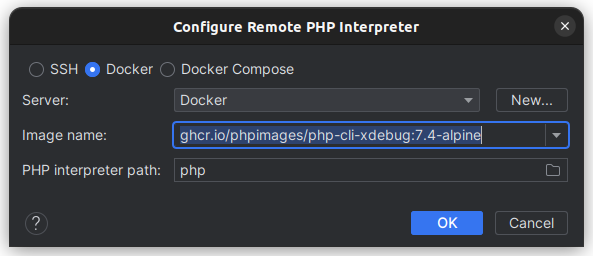

# Docker PHP utils images

## Images

> All images have Composer v2 installed.

See [Packages section](https://github.com/orgs/phpimages/packages)

### `ghcr.io/phpimages/php-cli-xdebug` : PHP CLI image with xdebug

**Available tags :**
`7.4-alpine`, `7.4-bullseye`, `8.0-alpine`, `8.0-bullseye`, `8.1-alpine`, `8.1-bullseye`, `8.2-alpine`, `8.2-bullseye`

### `ghcr.io/phpimages/php-cli-allinclusive`: PHP CLI image with commonly used extensions

**Available tags :**
`7.4-alpine`, `7.4-bullseye`, `8.0-alpine`, `8.0-bullseye`, `8.1-alpine`, `8.1-bullseye`, `8.2-alpine`, `8.2-bullseye`

## Usage

```shell
# Run composer install with any php version. 
# Example 8.2 : ghcr.io/phpimages/php-cli-xdebug:8.2-alpine
docker run -v .:/opt -u $(id -u):$(id -g) ghcr.io/phpimages/php-cli-xdebug:8.2-alpine composer install 
```

_`WORKDIR` is `/opt` on each images use `-v` to map your current dir with `/opt`._

## Intellij/PHPStorm integration

If you want to run php commands on IntelliJ for PHPUnit or Composer you will need a PHP interpreter.

On Settings > Languages and Framework > PHP define a new interpreter from Docker :


